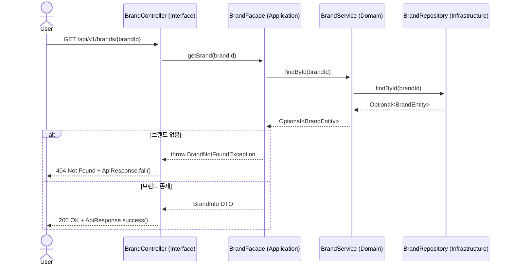
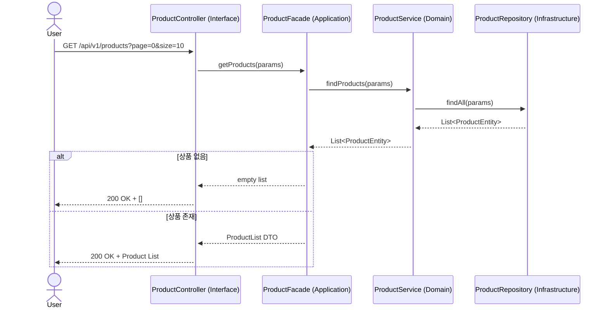
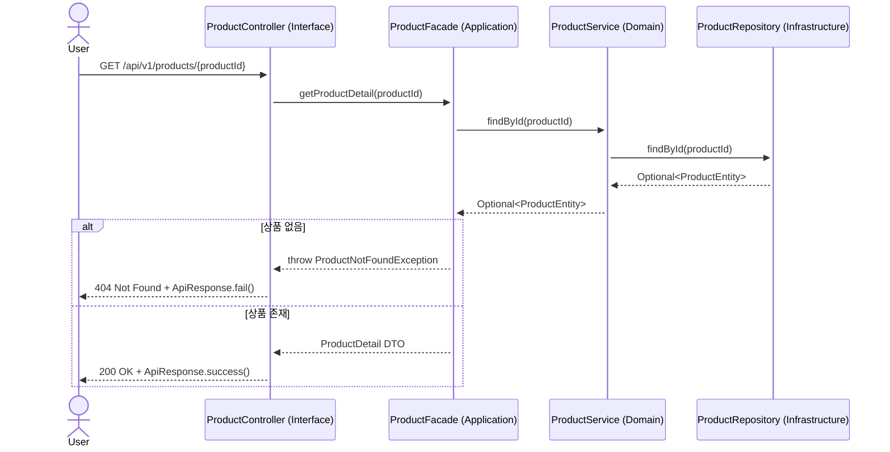
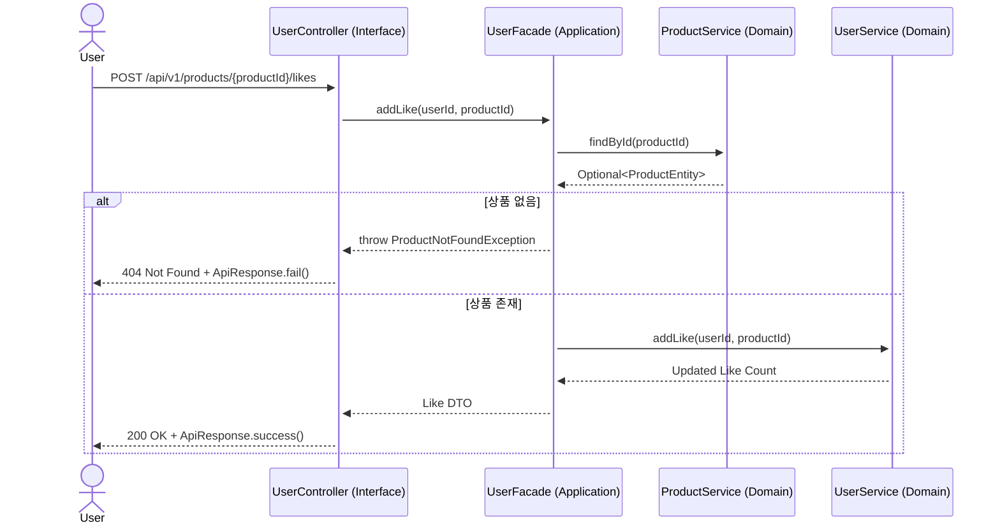
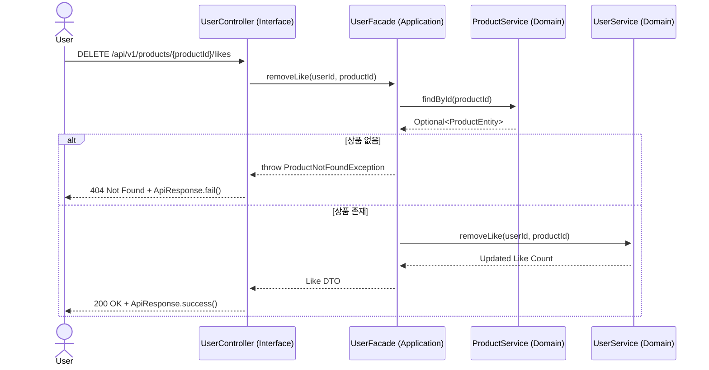
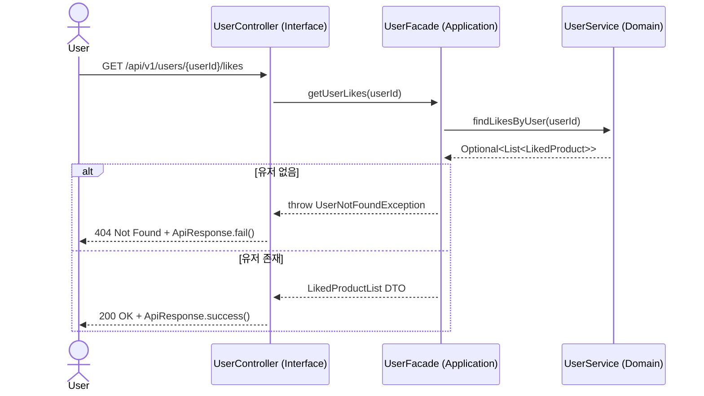
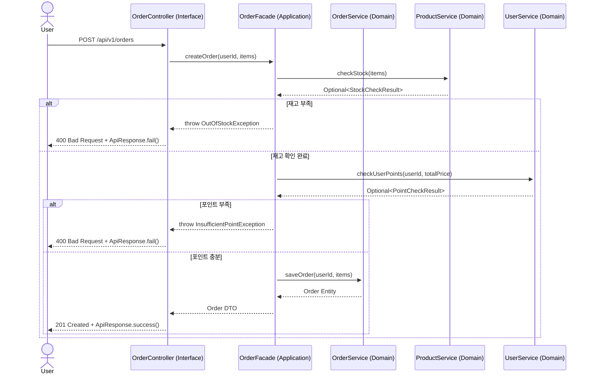
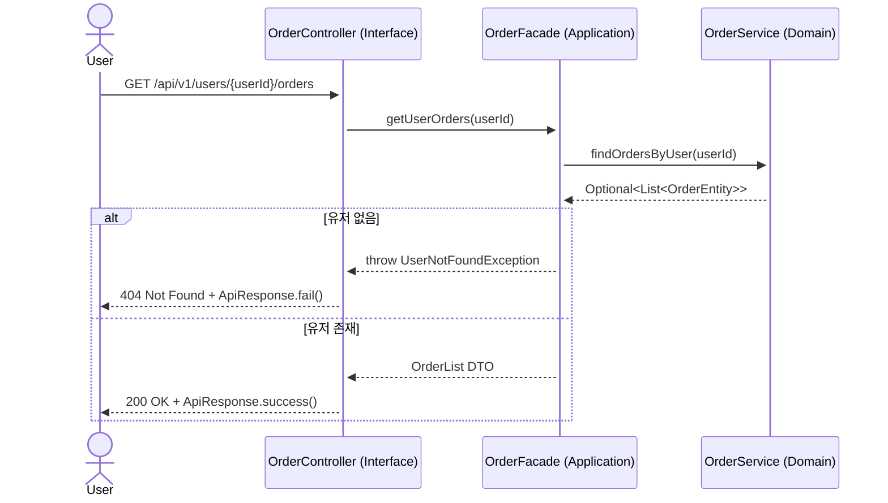
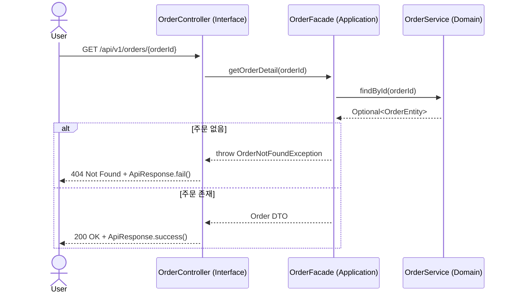

## ✈️ 시퀀스 다이어그램

---

### 🎈 브랜드 정보 조회

### 🎈 상품 목록 조회

### 🎈 상품 정보 조회

---

### 🎈 상품 좋아요 등록

### 🎈 상품 좋아요 취소

### 🎈 내가 좋아요 한 상품 목록 조회

---

### 🎈 주문 요청

### 🎈 유저의 주문 목록 조회

### 🎈 단일 주문 상세 조회

