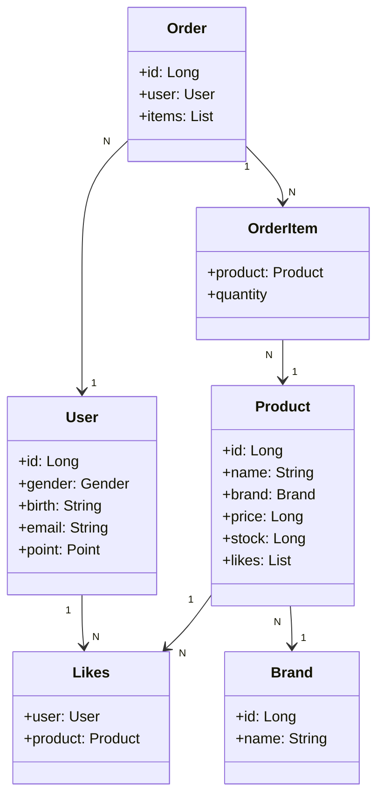

## ✈️ 클래스 다이어그램

```mermaid
classDiagram
class User {
+id: Long
+gender: Gender
+birth: String
+email: String
+point: Point
}

class Product {
+id: Long
+name: String
+brand: Brand
+price: Long
+stock: Long
+likes: List
}

class Brand {
+id: Long
+name: String
}

class Order {
+id: Long
+user: User
+items: List
}

class OrderItem {
+product: Product
+quantity
}

class Likes {
+user: User
+product: Product
}

Order "N" --> "1" User
Order "1" --> "N" OrderItem
OrderItem "N" --> "1" Product
Product "N" --> "1" Brand
User "1" --> "N" Likes
Product "1" --> "N" Likes

```