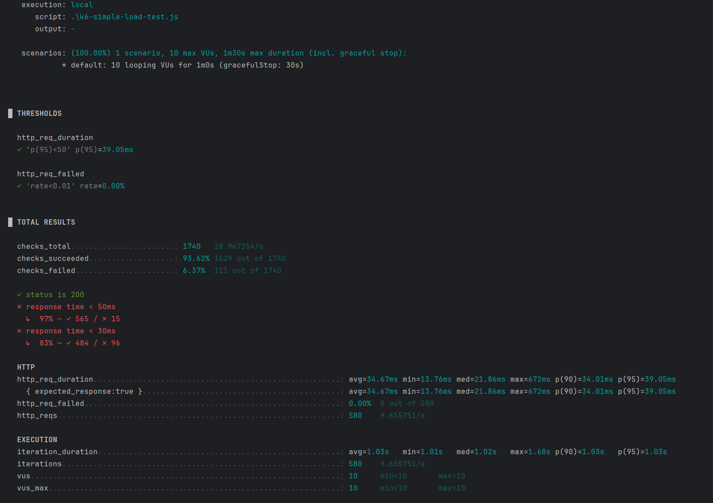
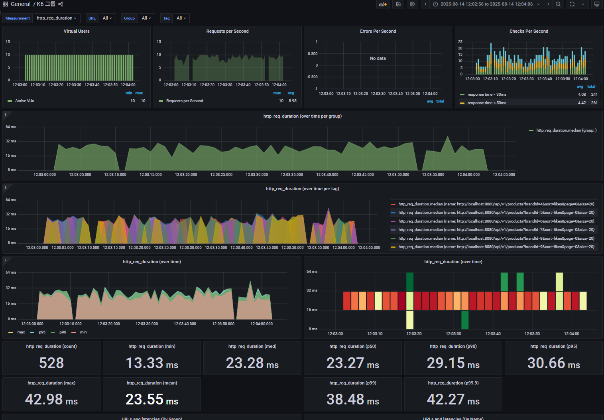
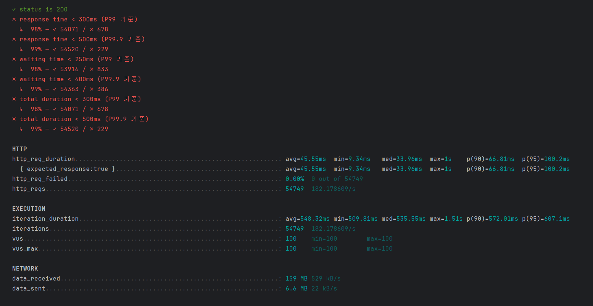

## 📊 생성되는 데이터

### 상품 데이터 구조
- **상품명**: "관형사 + 아이템" 형태 (예: "하얀 바다의 지팡이혼")
- **브랜드**: 1~1,000 사이의 랜덤 값
- **가격**: 1,000 ~ 1,000,000 사이의 랜덤 값
- **재고**: 0 ~ 1,000 사이의 랜덤 값
- **좋아요**: 0 (초기값)

### 데이터 양
- **관형사**: 900개
- **아이템**: 1,000개  
- **브랜드**: 1,000개 (랜덤 할당)
- **총 조합 가능한 상품 수**: 900 × 1,000 = **90만개**
- **실제 생성되는 상품 수**: **90만개**

### Brand 조회 API 최초 성능 테스트

### **테스트 목표**

1. 브랜드 별 상품 조회 API 성능
2. 좋아요 순 정렬 조회 성능

### **테스트 설정**

- **가상 사용자**: 10명 (동시 접속)
- **테스트 시간**: 1분간 지속
- **성능 기준**:
- 95% 요청이 50ms 이내 응답
- 실패율 1% 미만

### **테스트 시나리오**

1. 1~10 사이의 랜덤 브랜드 ID 선택
2. GET /api/v1/products API 호출
    - brandId: 랜덤 선택된 브랜드
    - sort=likes: 좋아요 순으로 정렬
    - page=0&size=20: 첫 페이지, 20개 상품 조회



### 최초 결과

- **최대 응답시간**: 672ms (정상 범위를 크게 초과)
- **평균 응답시간**: 34.67ms (목표 대비 양호)
- **문제**: 일부 요청에서 응답시간이 급격히 증가

### **2. 응답시간 분포**

- **중간값(median)**: 21.86ms
- **90% 백분위수**: 34.01ms
- **95% 백분위수**: 39.05ms

## **문제 원인 분석**

### **1. 성능 저하**

- 672ms라는 극단적인 응답시간은 **데이터베이스 쿼리 지연** 가능성
- **좋아요 순 정렬**이 복잡한 JOIN이나 집계 쿼리를 유발할 수 있음

### **2. 데이터베이스 관련 의심 요소**

- **좋아요 순 정렬**: ORDER BY likes가 인덱스가 없으면 성능 저하
- **브랜드별 필터링**: brandId 인덱스 최적화 필요
- **페이지네이션**: LIMIT 20 처리 시 성능 이슈



그라파나 + influxDB를 이용하여 K6 부하테스트를 대시보드로 보여주게 구현
### **P99, P99.9 중점 모니터링**

- **P99 < 300ms**: 99% 요청이 300ms 이내
- **P99.9 < 500ms**: 99.9% 요청이 500ms 이내
- **Waiting 시간**: P99 < 250ms, P99.9 < 400ms

### **100명 가상 사용자**

- **테스트 시간**: 5분
- **목표 TPS**: 초당 80 요청 이상
- **오류율**: 2% 미만

### **실제 사용자 시나리오**

- 다양한 브랜드, 페이지, 정렬 옵션
- 0.5초 대기 시간으로 자연스러운 부하

## 부하테스트 결과

### **1. P99 임계값 초과**

- **설정값**: p(99)<300ms
- **실제값**: p(99)=349.05ms
- **초과량**: 49.05ms (16% 초과)

### **2. P99.9 임계값 초과**

- **설정값**: p(99.9)<500ms
- **실제값**: p(99.9)=704.4ms
- **초과량**: 204.4ms (41% 초과)

### **3. Waiting 시간도 문제**

- **P99 waiting**: 324.39ms (250ms 초과)
- **P99.9 waiting**: 656ms (400ms 초과)

### 테스트를 통해 결론
- 여전히 임계값을 넘어서는 지표를 보여주며 병목 현상이 발생
- 병목 현상을 줄여보기위해 DB에서 인덱스를 생성

### DB인덱스 조회
```mysql
-- 인덱스를 확인
SHOW INDEX FROM product;
SHOW INDEX FROM brand;
-- 느린 쿼리를 분석
EXPLAIN SELECT * FROM product WHERE brand_id = ? ORDER BY likes DESC LIMIT 20;
```


| 지표              | AS-IS          | TO-BE |
|-----------------|----------------|-------|
| access_type     | ALL (전체 스캔)    | ref (인덱스 사용)   |
| rows_examined   | 850,212개       | 872개   |
| query_cost      | 86,583.45      | 197.07 | 
| using_filesort	 | true (디스크 정렬)	 |false (인덱스 정렬)|
| data_read	      | 88MB	          |926K|

brand_id (A) + likes (D)
- brand_id: 오름차순, 카디널리티 1,001
- likes: 내림차순, 카디널리티 589,408

**2. 커버링 인덱스 (idx_product_brand_likes_covering)**
brand_id (A) + likes (D) + id + name + price + stock

**테이블 접근 없이 인덱스만으로 모든 데이터 조회 가능해짐**


